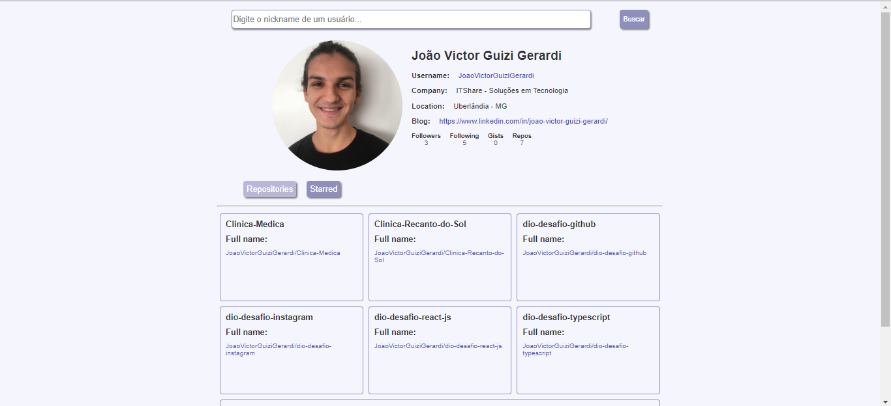

# Projeto ReactJS DIO

Projeto que apresenta uma interface utilizando a API do GitHub https://api.github.com/

## Funcionalidades

Neste projeto, você conseguirá:

 - Procurar um usuário pelo nickname
 - Ver os dados do usuário
 - Ver os repositórios do usuário

## Amostra do Projeto

